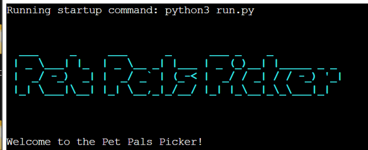

# Pet Pals Picker

 * This is a Python-based interactive quiz that helps users find the best pet for them based on their preferences.
Pet Pals Picker is an online quiz that users can take on behalf of someone else to determine which pet might suit them based on their situations and interests. It decouples decisions away from complex decision trees and simply frames it in terms of space, time, and what you like see. Users are provided with customized pet recommendations complete with detailed descriptions and ASCII art to help them determine which type of pet is a good fit. The benefits are time saving, creating safety due to reducing uncertainty and stress around what will make the best pet owner match, making it a fun user experience that helps people have incredible performing engaged fulfilling relationships every step of their way in their journey of being fulfilled male human caretakers.

## How to Use

1. **Run the Script**: Run the `run.py` script in your Python environment.
2. **Answer the Questions**: The quiz will ask you a series of questions about your preferences for a pet.
3. **Get Your Result**: Based on your answers, the quiz will recommend the best pet for you and display an ASCII art representation of the pet.

## Features

- **Interactive Quiz**: The quiz asks a series of questions to determine the best pet for the user.
- **ASCII Art**: The quiz displays ASCII art representations of the recommended pets.
- **Pet Recommendations**: The quiz provides a description of why the recommended pet is suitable for the user.

## Requirements

- **Python**: The script requires Python to be installed on your system.
- **Colorama Module**: The script uses the Colorama module to display colored text. You can install it using pip: `pip install colorama`.

## Running the Script

To run the script, simply execute the `run.py` file in your Python environment.

## Example Output

Here is an example output of the quiz:

### Python Libraries 
- [Text to ASCII Art](https://patorjk.com/software/taag/#p=display&f=Graffiti&t=Type%20Something%20) -  Used to display colored text.
- [ASCII](https://www.asciiart.eu/image-to-ascii) - Used to display ASCII art.
- [Colorama](https://pypi.org/project/colorama/) - used to display colored text

## Technologies Used

### Languages, Frameworks, Libraries & Programs Used
- [Code Institute Template](https://github.com/Code-Institute-Org/p3-template) used as a foundation for the project's frontend development.
- [Python](https://www.python.org/) was the primary programming language used to develap the Pet Pals Picker.
- [GitPod](https://www.gitpod.io/) was utilized for developing and testing the project within a cloud-based environment.
- [Visual Studio Code](https://code.visualstudio.com/) served as the integrated development environment (IDE) for writing and editing code.
- [GitHub](http://github.com) was used for hosting the project's code repository.
- [Heroku](http://heroku.com) was used for deploying the Pet Pals Picker game, allowing it to be accessible and playable online through a web browser.
- [Codeanywear](https://codeanywhere.com/) -  for coding
- [Grammarly](https://www.grammarly.com/) - grammarly.com for grammar and spelling
- [W3schools](https://www.w3schools.com/) - w3schools.com for input codes
- [Youtube](https://www.youtube.com/) - youtube.com for research
- [Codewof](https://codewof.co.nz/) - codewof.co.nz for checking the PEP8 style
- [Heroku](https://heroku.com) - heroku.com for deployment
- [TynyPNG](https://tinypng.com/) - for compressing images
- [ASCII](https://www.asciiart.eu/image-to-ascii) - used to display ASCII art
- [Text to ASCII Art](https://patorjk.com/software/taag/#p=display&f=Graffiti&t=Type%20Something) - used to display colored text
- [Colorama](https://pypi.org/project/colorama/) - used to display colored text
- [Flask](https://flask.palletsprojects.com/) - used to display ASCII art
- [Python-Cheat-Sheet](https://overapi.com/python)- used for cheat sheet and learning Python
- [Perplexity](https://www.perplexity.ai/?login-source=oneTapHome) - used for researching and learning Python

## Future features:
1. Bigger question pool: I plan to include more questions to associate the pet seeking method. Some just are not enough.

2. User profile: a profile for each user will enable them to continue later or save their personal proffered spit of some pet. I currently clear the user input after the recommendation.

3. Care advice: once a person finds the ideal pet, I want to add a tip section where based on their selected pet, the program will locate and show pet care tips.

4. GUI: add graphical user interface or develop a web platform of the program for more engagement. It’ll also allow us to use the database of pet breeds with different images.

5. Space for creative writing and a community forum for pet owner question answering or voluntary sharing of experience.

6. Mobile app. Due to the amount of free time, people spend using their phones, I plan to add a mobile version of the program to use it on the go.

## Flowchart Steps:
* Begin: The program is loaded.

* Show the ASCII art title and welcome message.

* Interrogative State : Ask the user a set of questions and let him answer, step by step

Q1: Ideal Size of Pet

Question 2: Time to Own the Pet

3: Quiet; Vocal (pet type).

Number 4: Room for the pet

Question 5: Aversion to Low Effort Care

Q6: Cage pet or Free?

Potential 7: How frequently they will ideally clean up

Question 8: Why is it important to learn beat dog tricks?

9- Do you want to live for a long time?

User 10: Day or Night Type of person?

Store Details: [questions => user's answer]

Find a Pet: Take decision logic based on answers to find the best pet

If small and minimal time:

If quiet: fish or frog

If vocal: bird

If small and moderate time:

Small space: Hamster or rabbit

If medium space: lizard

If medium:

If minimal care: cat

If moderate care: dog

If large:

If free: snake or turtle

Else: no suitable pet

* Output: Summary of the most suitable pet to be considered.

* View ASCIIFart:...an ASCII rendering of the pet you picked

End: Program ends.

## Flowchart Representation:

- Primary Display
- Greetings of Welcome
- If "Yes", proceed to Question Screen.
- If "No", return to Main Screen.
- Question Matrix
- Display questions and choices, user submits answers.
- Analyze responses, repeat until every question has been addressed.
- Recommendation for Animals
- Select the best-suited animal and present it.
- Screen of Results
- Display an ASCII artwork and an animal description.
- End Option to return to Main Screen.

## Testing

* The `ask_question' function now includes a `while True' loop to keep
asking for input until a valid number is entered.

* A `try-except block catches `ValueError exceptions to handle non-
numeric input.

* If the input is not a number or is out of the valid range, the user is
prompted to try again.

## Manual Testing Documentation

| Test Case ID | Description                      | Steps                          | Expected Result                                          | Actual Result                                           | Status | Comments                 |
|--------------|----------------------------------|--------------------------------|----------------------------------------------------------|---------------------------------------------------------|--------|--------------------------|
| TC01         | Initial Setup                    | Launch application             | Main Screen displays with an option to proceed           | Main Screen displayed with an option to proceed         | Pass   |                          |
| TC02         | Welcome Message (Yes)            | Select "Yes" for welcome       | Welcome Message displayed, proceed to Question Screen    | Welcome Message displayed, proceeded to Question Screen | Pass   |                          |
| TC03         | Welcome Message (No)             | Select "No" for welcome        | Return to Main Screen                                     | Returned to Main Screen                                 | Pass   |                          |
| TC04         | Answer Questions                 | Answer all questions           | Questions display sequentially, process answers correctly| Questions displayed sequentially, answers processed     | Pass   |                          |
| TC05         | Small, Quiet Pet (Fish)          | Provide specific answers       | Recommend a fish                                          | Recommended a fish                                       | Pass   |                          |
| TC06         | Medium, Vocal Pet (Dog)          | Provide specific answers       | Recommend a dog                                           | Recommended a dog                                        | Pass   |                          |
| TC07         | Large, Free-Roaming Pet (Snake)  | Provide specific answers       | Recommend a snake                                         | Recommended a snake                                      | Pass   |                          |
| TC08         | Result Display                   | Complete quiz and view result  | Result screen displays animal, description, and ASCII art | Result screen displayed animal, description, and ASCII art| Pass   |                          |
| TC09         | End Process                      | Return to Main Screen          | Return to Main Screen without errors                      | Returned to Main Screen without errors                  | Pass   |                          |

## Fixes for ascii art and title

- Added 'r prefix for raw strings to the ASCII art strings and the title string to
make them work in the terminal. This was necessary to handle backslashe correctly.
- With this correction, the code  resets the style changes properly when displaying
the ASCII art for the cat.

## PEP8 test

## Deployment
This project utilizes [Heroku](http://heroku.com) , for deployment, allowing developers to build, run, and manage applications in the cloud.
Follow these steps to deploy the Pet Pals Picker game on Heroku:

1. Create a New Heroku App
- Log in to Heroku or sign up for a new account.
- Navigate to your Heroku dashboard and click on the "New" button.
- Select "Create new app" from the dropdown menu.
- Choose a unique name for your app, select a region (EU or USA), and click "Create app".
2. Configure Environment Variables
- In your app's settings, navigate to the "Config Vars" section.
- Click on "Reveal Config Vars" and add the following variables:
  - PORT: Set the value to 8000.
  - Any other confidential credentials or configuration settings required by the game.
3. Add Buildpacks
- In the "Buildpacks" section, add the following buildpacks in the specified order:
  - Python
  - Node.js
4. Prepare Required Files
- Ensure your project includes the following files:
  - requirements.txt: Contains the project's Python dependencies.
  - Procfile: Specifies the commands to run the app.
5. Connect GitHub Repository

- Under the "Deploy" tab, select "GitHub" as the deployment method.
- Connect your GitHub repository to the Heroku app.
- Enable automatic deploys for continuous deployment.
6. Deploy Your App
- Trigger a manual deployment by clicking "Deploy Branch" or wait for automatic deployments to occur.
- Once deployed successfully, your Snake Game will be accessible via the provided Heroku URL.

## Deployment

The site was deployed to GitHub Pages. The steps to deploy are as follows:

- In the [GitHub repository](https://github.com/mirjanacale/Pet-Pals-Picker.git), navigate to the Settings tab
- From the source section drop-down menu, select the **Main** Branch, then click "Save".
- The page will be automatically refreshed with a detailed ribbon display to indicate the successful deployment.

The live link can be found [here](https://pet-pals-picker-74d71358a7be.herokuapp.com/)

### Local Deployment

This project can be cloned or forked in order to make a local copy on your own system.

#### Cloning

You can clone the repository by following these steps:

1. Go to the [GitHub repository](https://mirjanacale.github.io/Pet-Pals-Picker/)
2. Locate the Code button above the list of files and click it
3. Select if you prefer to clone using HTTPS, SSH, or GitHub CLI and click the copy button to copy the URL to your clipboard
4. Open Git Bash or Terminal
5. Change the current working directory to the one where you want the cloned directory
6. In your IDE Terminal, type the following command to clone my repository:
   - `git clone https://github.com/mirjanacale/Pet-Pals-Picker.git`
7. Press Enter to create your local clone.

Alternatively, if using Gitpod, you can click below to create your own workspace using this repository.

Please note that in order to directly open the project in Gitpod, you need to have the browser extension installed.
A tutorial on how to do that can be found [here](https://www.gitpod.io/docs/configure/user-settings/browser-extension).

#### Forking

By forking the GitHub Repository, we make a copy of the original repository on our GitHub account to view and/or make changes without affecting the original owner's repository.
You can fork this repository by using the following steps:

1. Log in to GitHub and locate the [GitHub Repository](https://mirjanacale.github.io/Pet-Pals-Picker/)
2. At the top of the Repository (not top of page) just above the "Settings" Button on the menu, locate the "Fork" Button.
3. Once clicked, you should now have a copy of the original repository in your own GitHub account!

### Local VS Deployment

There are no major differences between the local (Gitpod) version and the deployed (GitHub Pages) version that I'm aware of.

## Contributing
Contributions to the Quiz Game are welcome! If you have suggestions for new questions or improvements to the game, please feel free to open an issue .
